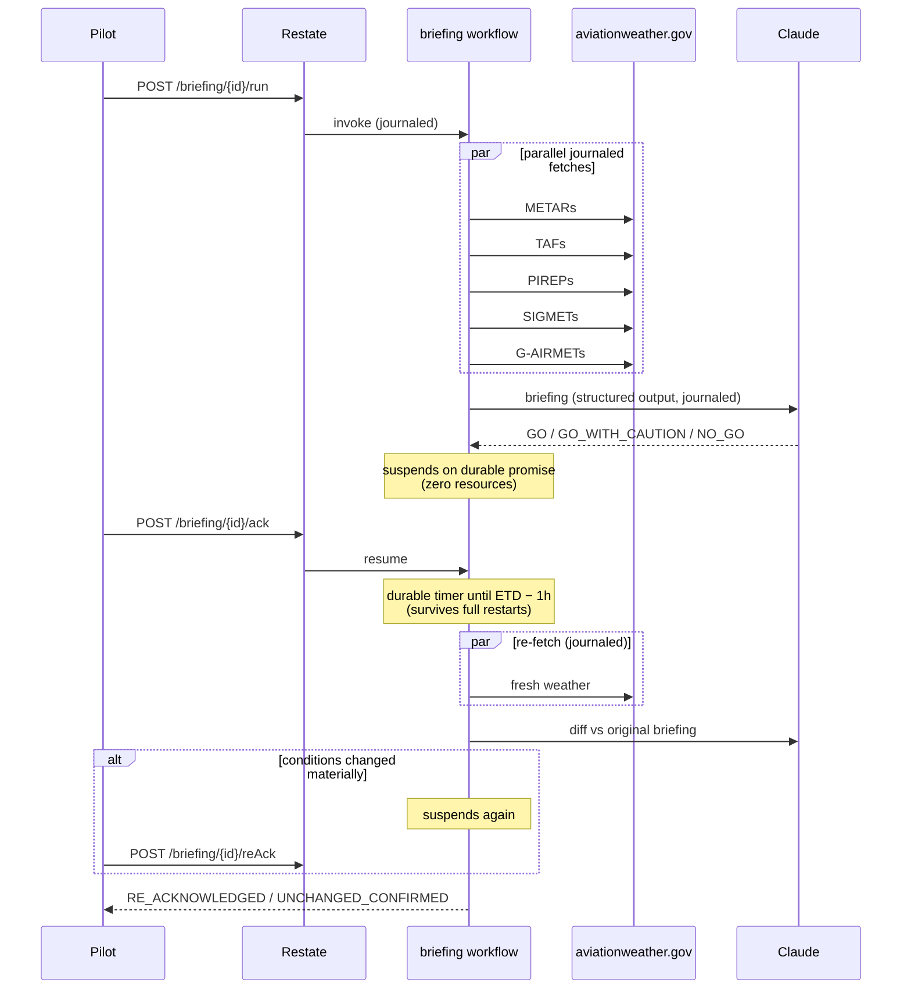

# Preflight Agent — durable AI flight briefings with Restate + Claude

> ⚠️ Demo only — **not for actual flight operations**. Always obtain an official weather briefing.

A pilot requests a preflight weather briefing for a flight. A [Restate](https://restate.dev) workflow durably fetches live aviation weather (METARs, TAFs, PIREPs, SIGMETs/G-AIRMETs) in parallel from the free [aviationweather.gov](https://aviationweather.gov/data/api/) API, has Claude turn the raw data into a plain-language briefing with a GO / NO-GO recommendation, then **suspends** — consuming zero resources — until the pilot acknowledges. After acknowledgment, a **durable timer** sleeps until one hour before departure, the weather is re-fetched, and Claude diffs conditions against the original briefing, flagging material changes for re-acknowledgment. Kill the process at any point and restart it: the workflow resumes exactly where it left off, replaying completed API and LLM calls from the journal instead of re-running them.



## Why durable execution for this

Weather briefings are genuinely time-sensitive and genuinely re-checked before real flights — the re-brief before departure is standard practice, not a contrived feature. Building this app *without* durable execution needs:

| Concern | Without Restate | With Restate |
|---|---|---|
| aviationweather.gov 502/504s (they happen) | hand-rolled retry loops with backoff | default retry policy on `ctx.run` |
| Not paying twice for LLM calls on failure | idempotency keys + a results cache | journal replay |
| Waiting hours for the pilot's ack | a database row + polling or a queue | durable promise; workflow suspends |
| "Re-check at ETD − 1h" | cron / scheduler + persisted state | `ctx.sleep()` |
| Process crashes mid-flow | reconciliation logic on startup | resume from the journal |

This repo contains none of that infrastructure. There is no database, no queue, no cron library, and not a single retry loop — state lives in Restate.

## Project layout

```
src/
  workflow.ts    the Restate workflow — every durable-execution pattern lives here
  weather.ts     aviationweather.gov client + normalization (204s, unit quirks, route filtering)
  briefing.ts    Anthropic Messages API calls, structured-output schemas, CFI system prompt
  validation.ts  input validation (ICAO idents, future ETD)
  types.ts       shared domain types
  app.ts         serves the workflow on :9080
  ui-server.ts   static server + ingress proxy for the pilot UI
ui/index.html    single-file pilot UI (no build step)
tests/           83 tests; fixtures are real captured API responses
demo/            restart wrapper for the kill -9 recovery demo
```

The workflow exposes four handlers, all invokable over plain HTTP through Restate's ingress (`:8080`):

| Handler | Kind | Purpose |
|---|---|---|
| `run` | workflow (runs once per briefing ID) | fetch weather → Claude briefing → wait for ack → durable timer → re-brief |
| `ack` | shared | pilot acknowledges the initial briefing (resolves the durable promise) |
| `reAck` | shared | pilot acknowledges the re-brief after a material change |
| `getStatus` | shared | read-only status: phase, briefing, re-brief — powers the UI |

## Quickstart

Prerequisites: Node 22+, an [Anthropic API key](https://console.anthropic.com/), and the Restate server (single binary or Docker, both shown).

```shell
git clone https://github.com/soos3d/preflight-agent
cd preflight-agent
npm install
cp .env.example .env   # put your ANTHROPIC_API_KEY in it, or export it in your shell
```

**1. Start the Restate server** (pick one):

```shell
# single binary — no Docker needed
npx @restatedev/restate-server
```

```shell
# or Docker — the volume matters: it keeps journal state across container restarts,
# which the recovery demo below depends on
docker run --name restate_dev -v restate_data:/restate-data \
  -p 8080:8080 -p 9070:9070 -p 9071:9071 \
  --add-host=host.docker.internal:host-gateway docker.restate.dev/restatedev/restate:latest
```

**2. Start the service** (in another terminal). It loads `.env` automatically (native Node env-file support); an exported `ANTHROPIC_API_KEY` in your shell also works and takes precedence:

```shell
npm run dev
```

**3. Register the service with Restate** (once):

```shell
npx @restatedev/restate -y deployments register localhost:9080 --force
# if the Restate server runs in Docker, use: ... register http://host.docker.internal:9080 --force
```

**4. Invoke a briefing** (set the ETD ~90 minutes out so you can watch the durable timer):

```shell
curl localhost:8080/restate/send/briefing/n123ab-kjax/run --json '{
  "departure": "KMCO",
  "destination": "KJAX",
  "alternate": "KDAB",
  "etdIso": "'$(date -u -v+90M +%Y-%m-%dT%H:%M:00Z 2>/dev/null || date -u -d "+90 minutes" +%Y-%m-%dT%H:%M:00Z)'",
  "flightRules": "VFR",
  "aircraft": "PA-28"
}'
```

**5. Watch it in the Restate UI** — open <http://localhost:9070>. You'll see the invocation's journal: five parallel weather fetches, the Claude call, and then the workflow **suspended** at the durable promise, consuming nothing while it waits for the pilot.

Check the briefing and acknowledge it:

```shell
curl localhost:8080/restate/call/briefing/n123ab-kjax/getStatus
curl localhost:8080/restate/call/briefing/n123ab-kjax/ack
```

After the ack, the workflow sleeps on a durable timer until ETD − 1h, re-fetches weather, diffs it, and either completes (`UNCHANGED_CONFIRMED`) or suspends again for `reAck` (`RE_ACKNOWLEDGED`).

**Optional pilot-facing UI**: `npm run ui` then open <http://localhost:3000> — a single static page that polls `getStatus`, renders the briefing with a GO/NO-GO badge and hazards table, and exposes the Acknowledge buttons.

## Kill it (the recovery demo)

This is the point of the example — scripted and repeatable:

1. Start the Restate server (either way, above). Start the service under the restart wrapper with slow mode on, so journaled steps take a few seconds each and the kill window is easy to hit:

   ```shell
   SLOW_MODE=true ./demo/restart-service.sh
   ```

2. Invoke a briefing with an ETD ~10 minutes out (step 4 above, with `+10M`). Watch the service log print lines like:

   ```
   [side effect] initial: fetched 3 METARs
   [side effect] initial: fetched 3 TAFs
   ```

3. **Mid-fetch, kill the service hard** (from another terminal):

   ```shell
   kill -9 $(pgrep -f "tsx.*src/app.ts")
   ```

   The wrapper restarts it. Watch the log: the fetches that completed before the kill do **not** print again — their results are replayed from the journal. Only the steps that hadn't finished run. Same for the Claude call: kill after `[side effect] Claude briefing complete` and you will not be billed for a second LLM call — the briefing is replayed.

4. **Same test across the durable timer**: acknowledge the briefing, then kill *everything* — the service **and** the Restate server (Ctrl-C or `docker stop restate_dev`). Wait a moment, restart both — no re-registration needed, the deployment is remembered. At ETD − 1h the timer fires and the re-brief runs as if nothing happened. (The single binary persists state in `./restate-data`; the Docker command above persists it in the `restate_data` volume — both survive a full restart.)

An automated variant of the replay test lives in the test suite: the e2e test starts a real Restate server with `alwaysReplay` (forcing a full journal replay at every suspension point) and asserts via mock-server hit counters that each weather fetch and each Claude call executed exactly once.

## Tests

```shell
npm test          # unit + integration: validation, weather parsing (real captured
                  # fixtures), prompt construction, schemas, mocked end-to-end pipeline
npm run test:e2e  # true e2e against a real Restate server (requires Docker)
```

Weather fixtures under `tests/fixtures/` are real aviationweather.gov responses captured on 2026-07-21.

## Limitations

- **NOTAMs are not included.** The FAA NOTAM API requires account registration, so this demo deliberately omits them. A real preflight briefing must include NOTAMs.
- **This is not an official weather briefing and is not for real flight planning.** Always obtain an official briefing (1800wxbrief.com / Flight Service) before actual flight operations.
- SIGMET/G-AIRMET route filtering uses a simple bounding box around the route's stations — good enough for a demo, not for dispatch.
- The AWC API is rate-limited (100 requests/min) and CONUS-focused; international routes will have gaps.

## Notes for Restate folks

This example intentionally uses the **plain Anthropic SDK** (`@anthropic-ai/sdk`, Messages API with structured outputs) rather than an agent framework — it's shaped to slot into [`restatedev/ai-examples`](https://github.com/restatedev/ai-examples) alongside the existing framework integrations, which currently have no plain-Anthropic example. Patterns showcased: journaled LLM/tool calls (`ctx.run`), parallel fan-out (`RestatePromise.all`), human-in-the-loop approval (durable promises), durable timers (`ctx.sleep`), suspend-while-idle, and crash recovery from the journal.

## Environment variables

| Variable | Default | Purpose |
|---|---|---|
| `ANTHROPIC_API_KEY` | — (required) | Claude API key |
| `ANTHROPIC_MODEL` | `claude-sonnet-5` | Model used for briefings |
| `RESTATE_URL` | `http://localhost:8080` | Ingress URL used by the UI proxy |
| `UI_PORT` | `3000` | Port for the pilot UI server |
| `SLOW_MODE` | `false` | Adds ~4s latency inside journaled steps for the kill demo |

Set them in `.env` (loaded automatically) or export them in your shell — shell values win.

## License

MIT — see [LICENSE](LICENSE).
