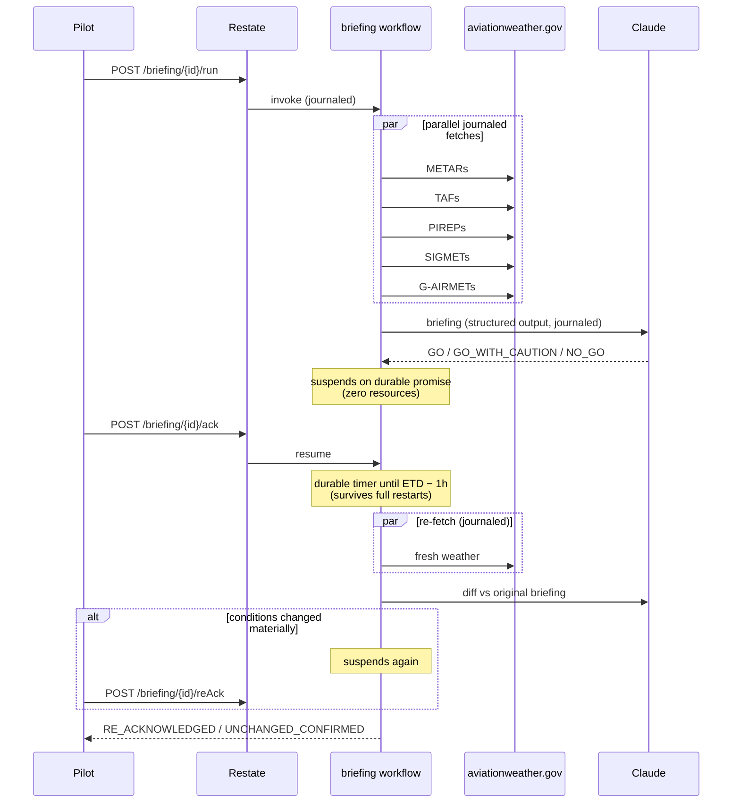

# Preflight Agent — durable AI flight briefings with Restate + Claude

> ⚠️ Demo only — **not for actual flight operations**. Always obtain an official weather briefing.

A pilot asks for a preflight weather briefing. A [Restate](https://restate.dev) workflow fetches live aviation weather (METARs, TAFs, PIREPs, SIGMETs/G-AIRMETs) in parallel from [aviationweather.gov](https://aviationweather.gov/data/api/), has Claude write a plain-language briefing with a GO / NO-GO recommendation, then **suspends — consuming zero resources** — until the pilot acknowledges. A **durable timer** then sleeps until one hour before departure, the weather is re-fetched, and Claude diffs conditions against the original briefing, flagging material changes.

Kill the process anywhere in that story and restart it: the workflow resumes exactly where it left off, replaying completed API and LLM calls from Restate's journal instead of re-running (or re-billing) them.

**The entire durable-execution story is one file: [`src/workflow.ts`](src/workflow.ts) — about 160 lines.** Everything else in the repo is ordinary plumbing (a weather API client, Claude prompts, input validation). If you read one thing, read that file top to bottom. This README walks it step by step, right after you run it.



## Run it — 5 minutes

Prerequisites: Node 22+ and an [Anthropic API key](https://console.anthropic.com/). No database, no queue, no cron — that absence is the point.

**1. Clone and configure:**

```shell
git clone https://github.com/soos3d/preflight-agent-restate
cd preflight-agent-restate
npm install
cp .env.example .env   # put your ANTHROPIC_API_KEY in it
```

**2. Start the Restate server** — a single binary, no Docker needed:

```shell
npx @restatedev/restate-server
```

<details>
<summary>Prefer Docker?</summary>

```shell
# The volume matters: it keeps journal state across container restarts,
# which the recovery demo below depends on.
docker run --name restate_dev -v restate_data:/restate-data \
  -p 8080:8080 -p 9070:9070 -p 9071:9071 \
  --add-host=host.docker.internal:host-gateway docker.restate.dev/restatedev/restate:latest
```

</details>

**3. Start the service and register it** (in another terminal — `.env` is loaded automatically):

```shell
npm run dev
npx @restatedev/restate -y deployments register localhost:9080 --force
# Restate server in Docker? use: ... register http://host.docker.internal:9080 --force
```

Registration is a **one-time step**, not part of the run loop: it tells the Restate server where the service is deployed and which handlers it exposes, and Restate persists that in its own metadata store. It survives restarts of the server, the service, or both — the recovery demo below depends on exactly that. You only register again when the service's public surface changes (handlers added or signatures changed); `--force` just overwrites the same deployment so local iteration stays a one-liner.

**4. Request a briefing.** The briefing itself arrives in **seconds** — the departure time below is set ~90 minutes out only so the *re-brief* timer, which fires at ETD − 1h, comes due about 30 minutes after you acknowledge: close enough to watch, far enough to prove the timer is real.

```shell
curl localhost:8080/restate/send/briefing/n123ab-kjax/run --json '{
  "departure": "KMCO",
  "destination": "KJAX",
  "alternate": "KDAB",
  "etdIso": "'$(date -u -v+90M +%Y-%m-%dT%H:%M:00Z 2>/dev/null || date -u -d "+90 minutes" +%Y-%m-%dT%H:%M:00Z)'",
  "flightRules": "VFR",
  "aircraft": "PA-28"
}'
```

**5. Watch it in the Restate UI** — open <http://localhost:9070> and click the invocation. You'll see the journal: five parallel weather fetches, one Claude call, and then the workflow **suspended** at a durable promise, consuming nothing while it waits for a human.

By the time you've opened the UI, `getStatus` already returns the full briefing — summary, hazards, GO/NO-GO. Read it, then acknowledge:

```shell
curl localhost:8080/restate/call/briefing/n123ab-kjax/getStatus
curl localhost:8080/restate/call/briefing/n123ab-kjax/ack
```

After the ack, the workflow sleeps on a durable timer until ETD − 1h (~30 minutes away with the ETD above), re-fetches the weather, and either completes (`UNCHANGED_CONFIRMED`) or suspends again for `reAck` if conditions changed materially.

**Optional pilot UI**: `npm run ui`, then open <http://localhost:3000> — briefing, GO/NO-GO badge, hazards table, and the Acknowledge buttons, no build step.

## How it works — a tour of `workflow.ts`

The workflow is invoked over plain HTTP through Restate's ingress and keyed by a briefing ID (`n123ab-kjax` above). Restate guarantees the `run` handler executes **exactly once per key**, journaling every step. Here is the whole flow, in file order.

### 1. Journaled side effects, fanned out in parallel

Each weather fetch is wrapped in `ctx.run`, which records its result in Restate's journal. On a retry or crash, completed steps are **replayed from the journal, not re-executed**. Transient aviationweather.gov 502s are handled by Restate's default retry policy — there isn't a retry loop anywhere in this repo.

```ts
const [metars, tafs, pireps, sigmets, gairmets] = await RestatePromise.all([
  ctx.run(`${label}: fetch METARs`, () => fetchMetars(stations)),
  ctx.run(`${label}: fetch TAFs`,   () => fetchTafs(stations)),
  // ... PIREPs, SIGMETs, G-AIRMETs
]);
```

Note `RestatePromise.all`, not `Promise.all` — Restate journals completion order so replay stays deterministic. Same reason the code uses `ctx.date.now()` instead of `Date.now()`.

### 2. The LLM call is a journaled step too

```ts
const briefing = await ctx.run("claude briefing", () =>
  requestBriefing(client, model, request, stations, weather),
);
```

This is the pattern that matters for AI workloads: if the process dies *after* this step completes, recovery replays the journaled briefing — **you are never billed for a second Claude call**. The call itself (in [`src/briefing.ts`](src/briefing.ts)) uses the Messages API with structured outputs; non-retryable API errors (auth, bad request) are converted to `TerminalError` so Restate fails fast instead of retrying forever.

### 3. Human in the loop: suspend on a durable promise

```ts
await ctx.promise<boolean>("pilot-ack");
```

That single line parks the workflow — possibly for hours — with **zero processes waiting and zero resources consumed**. A separate shared handler resolves it when the pilot acks over HTTP:

```ts
ack: async (ctx) => {
  const promise = ctx.promise<boolean>("pilot-ack");
  if ((await promise.peek()) === undefined) await promise.resolve(true);
},
```

### 4. A durable timer until ETD − 1h

```ts
await ctx.sleep(delayMs, "wait until ETD - 1h");
```

Not `setTimeout`, not cron: the timer lives in Restate. Kill the service **and** the Restate server, restart both later — the timer fires on schedule and the workflow continues as if nothing happened.

### 5. Re-brief: fresh fetch, Claude diffs against the original

The same journaled fan-out runs again, then a second Claude call compares fresh conditions against the original briefing and decides whether the change is material (new convective activity, a category drop in ceilings/visibility — not routine METAR churn). If it is, the workflow suspends on a second durable promise for `reAck`.

### 6. Workflow state powers the UI

Each phase transition is written with `ctx.set("phase", ...)`, and the shared `getStatus` handler reads it back concurrently with the running workflow — that one read-only endpoint is all the pilot UI polls. No database; the workflow *is* the state store.

## Break it — the kill -9 recovery demo

This is the point of the example, scripted and repeatable:

1. Start the service under the restart wrapper with slow mode on (journaled steps take ~4s each, so the kill window is easy to hit):

   ```shell
   SLOW_MODE=true ./demo/restart-service.sh
   ```

2. Request a briefing with an ETD ~10 minutes out (step 4 above, with `+10M`). The log prints each journaled step:

   ```
   [side effect] initial: fetched 3 METARs
   [side effect] initial: fetched 3 TAFs
   ```

3. **Mid-fetch, kill it hard** from another terminal:

   ```shell
   kill -9 $(pgrep -f "tsx.*src/app.ts")
   ```

   The wrapper restarts the service. Watch the log: fetches that completed before the kill do **not** print again — their results are replayed from the journal; only unfinished steps run. Kill after `[side effect] Claude briefing complete` and you won't pay for a second LLM call either.

4. **Now do it across the durable timer**: acknowledge the briefing, then kill *everything* — the service **and** the Restate server. Restart both — no re-registration needed. At ETD − 1h the timer fires and the re-brief runs as if nothing happened. (The single binary persists state in `./restate-data`; the Docker volume does the same.)

An automated version lives in the test suite: the e2e test runs a real Restate server with `alwaysReplay` (forcing a full journal replay at every suspension point) and asserts via mock-server hit counters that every weather fetch and every Claude call executed exactly once.

## What Restate replaces here

| Concern | Without Restate | In this repo |
|---|---|---|
| aviationweather.gov 502/504s (they happen) | hand-rolled retry loops with backoff | default retry policy on `ctx.run` |
| Not paying twice for LLM calls on failure | idempotency keys + a results cache | journal replay |
| Waiting hours for the pilot's ack | a database row + polling or a queue | durable promise; workflow suspends |
| "Re-check at ETD − 1h" | cron / scheduler + persisted state | `ctx.sleep()` |
| Process crashes mid-flow | reconciliation logic on startup | resume from the journal |

There is no database, no queue, no cron library, and not a single retry loop in this repo — state lives in Restate.

## Project layout

```
src/
  workflow.ts    ← START HERE: every durable-execution pattern, ~160 lines
  weather.ts     aviationweather.gov client + normalization (204s, unit quirks, route filtering)
  briefing.ts    Anthropic Messages API calls, structured-output schemas, CFI system prompt
  validation.ts  input validation (ICAO idents, future ETD)
  types.ts       shared domain types
  app.ts         serves the workflow on :9080
  ui-server.ts   static server + ingress proxy for the pilot UI
ui/index.html    single-file pilot UI (no build step)
tests/           83 tests; fixtures are real captured API responses
demo/            restart wrapper for the kill -9 recovery demo
```

The workflow exposes four handlers, all plain HTTP through Restate's ingress on `:8080`:

| Handler | Kind | Purpose |
|---|---|---|
| `run` | workflow (once per briefing ID) | fetch weather → Claude briefing → wait for ack → durable timer → re-brief |
| `ack` | shared | pilot acknowledges the initial briefing (resolves the durable promise) |
| `reAck` | shared | pilot acknowledges the re-brief after a material change |
| `getStatus` | shared | read-only status: phase, briefing, re-brief — powers the UI |

## Tests

```shell
npm test          # unit + integration: validation, weather parsing (real captured
                  # fixtures), prompt construction, schemas, mocked end-to-end pipeline
npm run test:e2e  # true e2e against a real Restate server (requires Docker)
```

Weather fixtures under `tests/fixtures/` are real aviationweather.gov responses captured on 2026-07-21.

## Limitations

- **NOTAMs are not included.** The FAA NOTAM API requires account registration, so this demo deliberately omits them. A real preflight briefing must include NOTAMs.
- **This is not an official weather briefing and is not for real flight planning.** Always obtain an official briefing (1800wxbrief.com / Flight Service) before actual flight operations.
- SIGMET/G-AIRMET route filtering uses a simple bounding box around the route's stations — good enough for a demo, not for dispatch.
- The AWC API is rate-limited (100 requests/min) and CONUS-focused; international routes will have gaps.

## Notes for Restate folks

This example intentionally uses the **plain Anthropic SDK** (`@anthropic-ai/sdk`, Messages API with structured outputs) rather than an agent framework — it's shaped to slot into [`restatedev/ai-examples`](https://github.com/restatedev/ai-examples) alongside the existing framework integrations, which currently have no plain-Anthropic example. Patterns showcased: journaled LLM/tool calls (`ctx.run`), parallel fan-out (`RestatePromise.all`), human-in-the-loop approval (durable promises), durable timers (`ctx.sleep`), suspend-while-idle, and crash recovery from the journal.

## Environment variables

| Variable | Default | Purpose |
|---|---|---|
| `ANTHROPIC_API_KEY` | — (required) | Claude API key |
| `ANTHROPIC_MODEL` | `claude-sonnet-5` | Model used for briefings |
| `RESTATE_URL` | `http://localhost:8080` | Ingress URL used by the UI proxy |
| `UI_PORT` | `3000` | Port for the pilot UI server |
| `SLOW_MODE` | `false` | Adds ~4s latency inside journaled steps for the kill demo |

Set them in `.env` (loaded automatically) or export them in your shell — shell values win.

## License

MIT — see [LICENSE](LICENSE).
